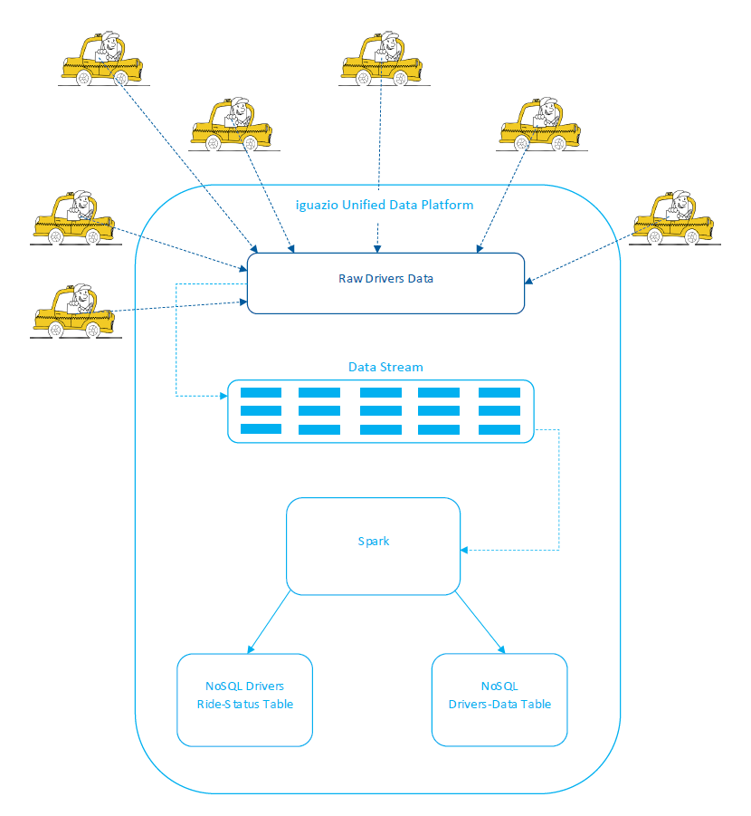

# Taxi-Streaming Example

In this document

- [Overview](#overview)
- [Running the Sample](#running-the-sample)
- [Code Walkthrough](#code-walkthrough)
- [Cleanup](#cleanup)

## Overview

### Use-Case Story

The taxi-streaming example &mdash; [**taxi_streaming**](https://github.com/v3io/iguazio_api_examples/tree/master/taxi_streaming) &mdash; demonstrates a possible use case of the iguazio Unified Data Platform (**the platform**) by a taxi company that provides ride-hailing services in the city of London and its surroundings.
The taxis send to the platform their current GPS coordinates and the IDs of the drivers, and the drivers also report their current ride status (available, busy, or with a passenger).
A producer application adds (ingests) the raw data into the platform as a continuous stream of data.
A consumer application reads the data from the stream, in parallel to the data ingestion, and saves it to a NoSQL data table in a platform data container.
In addition, the ride-status information is aggregated and saved to a NoSQL driver-status summary table that shows the current number of drivers in each status.

> **Note:** For demonstration purposes, the sample generates a CSV input file of randomly generated stream data in place of the real-time data transmission.

<p align="center"></p>

### Platform Capabilities and APIs

The sample demonstrates the following platform capabilities and API uses:

- Create a stream object with multiple shards using the platform's Streaming Web API.

- Produce stream data and ingest the data into the platform using the platform's Streaming Web API.

- Consume the stream data &mdash;

    - Read data from the stream into a Spark DataFrame, in parallel to the data ingestion, using the Spark Streaming API and the platform's Spark-Streaming Integration API.

    - Save the stream data &mdash; which includes the drivers' IDs, location, and ride status &mdash; to a NoSQL drivers-data table, using the platform's NoSQL Spark DataFrame.

    - Aggregate the driver-status data and save the information to a driver-status summary table that contains information about the current number of drivers in each status, using the platform's NoSQL Spark DataFrame.

## Running the Sample

> **Note:** Contact iguazio to schedule a live demo of the taxi-streaming sample, including an extra UI application that shows a heat map of the taxis' current locations.

### Copying the Sample to the Platform

To run the sample, you must first copy the sample's code files to an instance of the platform.
You can select to clone the [v3io/iguazio_api_examples](https://github.com/v3io/iguazio_api_examples) GitHub repository directly to any of the platform's application nodes.
The sample files are found in the **taxi_streaming** subdirectory of your clone directory.
Alternatively, you can clone the GitHub repository or download the [**taxi_streaming**](https://github.com/v3io/iguazio_api_examples/blob/master/taxi_streaming) sample directory from the repository's `master` branch to a local machine, and copy the sample directory to the platform.
(Note that when copying files from a Windows machine to the platform, you need to convert the files to a Unix format, which you can do using `dos2unix`.)

### Running the Code

The sample's root directory contains bash shell scripts that simplify the code execution.
Follow these steps to run the scripts and test the sample in less than two minutes; (the most time-consuming task is the generation of the random test data):

> **Note:** By default, the sample creates the stream and NoSQL tables in a **taxi_streaming_example** directory in the default "bigdata" container.
> You can view the directory's contents in the platform's graphical dashboard (select the container from the **Containers** view and then select the **Browse** tab) or from the command line via your platform's distributed file system (DFS) mount (for example, `ls /mnt/datalake/bigadata/taxi_streaming_example/`).

1.  <a id="sample_run_create_random_drivers_data_sh"></a>
    Generate data &mdash; use the [**create_random_drivers_data.sh**](https://github.com/v3io/iguazio_api_examples/tree/master/taxi_streaming/create_random_drivers_data.sh) script to run the **create_random_drivers_data.py** application, which generates a **drivers_data.csv** file that contains the input data for the stream:

    ```sh
    ./create_random_drivers_data.sh
    ```

    > **Note:** The script execution might take about a minute to complete.

    For more information, see the [**create_random_drivers_data.py**](#code_walkthrough_create_random_drivers_data_py) code walkthrough.

2.  <a id="sample_run_create_drivers_stream_sh"></a>
    Create a stream &mdash; use the [**create_drivers_stream.sh**](https://github.com/v3io/iguazio_api_examples/tree/master/taxi_streaming/create_drivers_stream.sh) script to create a **taxi_streaming_example/drivers_stream** stream in the "bigdata" container:

    ```sh
    ./create_drivers_stream.sh
    ```

    For more information, see the [**create_drivers_stream.sh**](#code_walkthrough_create_drivers_stream_sh) code walkthrough.

3.  <a id="sample_run_spark_submit_cmd_sh"></a>
    Consume the stream data &mdash; use the [**spark-submit_cmd.sh**](https://github.com/v3io/iguazio_api_examples/tree/master/taxi_streaming/spark-submit_cmd.sh) script to run a **spark-submit** CLI command that starts a Spark job for running the **consume_drivers_stream_data.py** consumer application.
      The application reads data continuously from the stream and uses the data to create **drivers_table** and **driver_status_summary_table** NoSQL tables in the **taxi_streaming_example** directory of the "bigdata" container:

    ```sh
    ./spark-submit_cmd.sh
    ```

    > **Note:** The consumer application must be run while the **stream_drivers_data.py**  producer application is running (see [Step 4](#sample_run_stream_drivers_data_sh)), so that the stream data can be consumed in parallel to its ingestion.
    > The consumer application reads data continuously, until it's stopped.
    > Therefore, it should be run in a separate bash session or as a background process.
    > After you run the producer application and verify that the consumer application created the NoSQL tables, you can stop the consumer application, as outlined in [Step 5](#sample_run_consumer_app_stop).

    For more information, see the [**consume_drivers_stream_data.py**](#code_walkthrough_consume_drivers_stream_data_py) code walkthrough.

4.  <a id="sample_run_stream_drivers_data_sh"></a>
    Produce and ingest the stream data into the platform &mdash; use the [**stream_drivers_data.sh**](https://github.com/v3io/iguazio_api_examples/tree/master/taxi_streaming/stream_drivers_data.sh) script to run the **stream_drivers_data.py** producer application, which adds data to the stream that you created in [Step 2](#sample_run_create_drivers_stream_sh) (i.e., ingests stream data into the platform):

    ```sh
    ./stream_drivers_data.sh
    ```

    The script passes to the application the **drivers_data.csv** file that you generated in [Step 1](#sample_run_create_random_drivers_data_sh) (see `INPUT_FILE`).

    > **Note:** You need to run the producer application while the **consume_drivers_stream_data.py** consumer application is running.
    > See the information in [Step 3](#sample_run_spark_submit_cmd_sh).

    For more information, see the [**stream_drivers_data.py**](#code_walkthrough_stream_drivers_data_py) code walkthrough.

5.  <a id="sample_run_consumer_app_stop"></a>
    Stop the consumer application &mdash; after the producer application (**stream_drivers_data.py**) completes its execution (see [Step 4](#sample_run_stream_drivers_data_sh)), verify that the **taxi_streaming_example** directory of the "bigdata" container contains the generated **drivers_table** and **driver_status_summary_table** tables.
    Once verified, you can stop the process that's running the consumer application (e.g., using `CTRL-C`).


## Code Walkthrough

Following is an in-depth walkthrough of the sample's code files:

- [**create_random_drivers_data.py** &mdash; Generate Random Drive Data](#code_walkthrough_create_random_drivers_data_py)
- [**create_drivers_stream.sh** &mdash; Create a Stream](#code_walkthrough_create_drivers_stream_sh)
- [**stream_drivers_data.py** &mdash; Produce and Ingest the Stream Data](#code_walkthrough_stream_drivers_data_py)
- [**consume_drivers_stream_data.py** &mdash; Consume the Stream Data](#code_walkthrough_consume_drivers_stream_data_py)

<a id="code_walkthrough_create_random_drivers_data_py"></a>
### create_random_drivers_data.py &mdash; Generate Random Drive Data

The [**create_random_drivers_data.py**](https://github.com/v3io/iguazio_api_examples/tree/master/taxi_streaming/create_random_drivers_data.py) Python application generates randomized drivers data and saves it to a **drivers_data.csv** file, which will be added to the stream as part of the [stream-data ingestion](#code_walkthrough_stream_drivers_data_py).
The randomized data generation is used to support a standalone sample that can be run as-is on any instance of the iguazio Unified Data Platform.
The use of a CSV file was chosen because it's a straightforward implementation that's easy to demonstrate.
Real-life scenarios will typically use a more efficient method to retrieve the actual stream data.

> **Note:** You can use the **create_random_drivers_data.sh** bash script to run the **create_random_drivers_data.py** application, as explained in [Step 1](#sample_run_create_random_drivers_data_sh) of the "Running the Code" instructions.

The generated stream data includes a numeric driver ID, a data-generation timestamp, the taxi's current GPS coordinates, and the driver's current ride status.
The ride status can be one of the following:

- "Available" &mdash; the driver is available for a new ride.
- "Busy" &mdash; the driver is unavailable for a new ride but is not currently with a passenger (for example, if the driver is currently on route to pick up a passenger).
- "Passenger" &mdash; the driver is in an active ride with a passenger.

> **Note:** You can edit your copy of the **create_random_drivers_data.py** file to change the data.
> For example, you can use GPS coordinates from your preferred geographical region.
> Note that if you select to change the structure of the CSV data, you need to edit the stream-data producer and consumer applications accordingly.

<a id="code_walkthrough_create_drivers_stream_sh"></a>
### create_drivers_stream.sh &mdash; Create a Stream

The [**create_drivers_stream.sh**](https://github.com/v3io/iguazio_api_examples/tree/master/taxi_streaming/create_drivers_stream.sh) bash script creates a **taxi_streaming_example/drivers_stream** stream directory (`$STREAM_PATH`) in the "bigdata" container (`$CONTAINER_NAME`).
The stream is created with 12 shards (`$NUM_SHARDS`) and a guaranteed data-retention period of one hour (`$RETENTION_PERIOD`).

> **Note:** See [Step 2](#sample_run_create_drivers_stream_sh) of the "Running the Code" instructions for information about running this script.

The stream is created with the `CreateStream` operation of the platform's Streaming Web API.
The operation is executed by using a `curl` CLI command that sends an HTTP request with an `X-v3io-function` header to the platform's web-gateway service at IP address `127.0.0.1` (`$NGINX_IP`) port `8081` (`$NGNIX_PORT`).
The shard-count and retention-period request parameters are set in the request's JSON-body data payload (see the `--data` option).

```sh
curl -X PUT \
    --header "Content-type: application/json" \
    --header "X-v3io-function: CreateStream" \
    --header "Cache-Control: no-cache" \
    --data "{'ShardCount': ${NUM_SHARDS}, 'RetentionPeriodHours': ${RETENTION_PERIOD}}" \
    http://${NGINX_IP}:${NGINX_PORT}/${CONTAINER_NAME}${STREAM_PATH}/
```

<a id="code_walkthrough_stream_drivers_data_py"></a>
### stream_drivers_data.py &mdash; Produce and Ingest the Stream Data

The [**stream_drivers_data.py**](https://github.com/v3io/iguazio_api_examples/tree/master/taxi_streaming/stream_drivers_data.py) Python application implements the stream-producer function of adding data records to the **taxi_streaming_example/drivers_stream** stream (`STREAM_PATH`) of the "bigdata" container (`CONTAINER_NAME`), and thereby ingesting the stream data into the platform.

> **Note:** You can use the **stream_drivers_data.sh** bash script to run the **stream_drivers_data.py** application, as explained in [Step 4](#sample_run_stream_drivers_data_sh) of the "Running the Code" instructions.

The application receives as an argument the path to a comma-delimited CSV stream-data input file (`INPUT_FILE`).
The **stream_drivers_data.sh** script passes the **drivers_data.csv** file that was generated by the [**create_random_drivers_data.py**](#code_walkthrough_create_random_drivers_data_py) application as the CSV-file argument.

The local `get_driver_data` function iterates the rows of the input CSV file (`INPUT_FILE`) and reads them into a `drivers_data` list of stream-record data "messages" to send to the platform.
For each message in the `drivers_data` list, the local `structure_message` function is used to create a structured data-message JSON object.
The local `encode_data` function is then used to translate each structured-message JSON object into a stream-record JSON object with a `Data` string key that's assigned the Base64 encoding of the data message (`{"Data": <Base64 encoded message string>}`).
The encoded record-data JSON objects are added to a batch list (`batch`).
When the configured batch size is reached (`STREAM_RECORDS_BATCH_SIZE` = 500), or when the last batch messages remain, the local `send_records` function is called to add the records to the stream:

```python
drivers_data = get_driver_data()
batch = []
for msg in drivers_data:
    jmsg = json.dumps(structure_message(msg))
    # print jmsg
    batch.append(encode_data(jmsg))

    if len(batch) == STREAM_RECORDS_BATCH_SIZE:
        send_records(batch)
        batch = []
send_records(batch)
```

`send_records` uses the `PutRecords` operation of the platform's Streaming Web API to add the data records to the stream (i.e., ingest the data into the platform).
The operation is executed by using the Python `requests.post` method to send an HTTP request with an `X-v3io-function` header to the platform's web-gateway service at IP address `127.0.0.1` (`NGINX_IP`) port `8081` (`NGNIX_PORT`):

```python
def send_records(records):
    # print len(records)
    payload = {"Records": records}
    headers = get_function_headers("PutRecords")
    url = get_stream_url()
    try:
        response = requests.post(url, json=payload, headers=headers, timeout=1)
        # print "status: {0}".format(response.status_code)
    except Exception, e:
        print "ERROR: {0}".format(str(e))
```

The request's URL is prepared by using the local `get_stream_url` function:

```python
def get_stream_url():
    return "http://{0}:{1}/{2}{3}/" \
        .format(NGINX_IP, NGINX_PORT, CONTAINER_NAME, STREAM_PATH)
```

The request's headers are prepared by using the local `get_function_headers` function:

```python
def get_function_headers(v3io_function):
    return {"Content-Type": "application/json",
            "Cache-Control": "no-cache",
            "X-v3io-function": v3io_function
            }
```

The request's JSON-body data payload is created by defining a `Records` JSON array object with the data-messages record objects that were prepared in the `batch` list and passed to `send_records` within its `records` parameter:

```python
    payload = {'Records': records}
```

<a id="code_walkthrough_consume_drivers_stream_data_py"></a>
### consume_drivers_stream_data.py &mdash; Consume the Stream Data

The [**consume_drivers_stream_data.py**](https://github.com/v3io/iguazio_api_examples/tree/master/taxi_streaming/consume_drivers_stream_data.py) Python application implements the stream-consumer function of reading the data records that were added to the **taxi_streaming_example/drivers_stream** stream (`STREAM_PATH`) of the "bigdata" container (`CONTAINER_NAME`), in parallel to the data ingestion by the producer.
The data is decoded and used to create NoSQL data tables in the **taxi_streaming_example** "bigdata" container directory (see `NOSQL_TABLES_PATH`).

> **Note:** When the retention period that was set during [the stream's creation](#code_walkthrough_create_drivers_stream_sh) elapses, the earliest data records in the stream might be deleted to make room for newer records.
> Therefore, the records should be consumed, sequentially, in parallel to the addition of new records by the producer.

The application uses Spark APIs and is intended to be run as a Spark Job.
To allow using the Spark Streaming API, the application uses the platform's Spark-Streaming Integration Python API.
The required libraries for this API can be found in the **~/igz/bigdata/libs/v3io-py.zip** archive file on the platform.

> **Note:** You can use the **spark-submit_cmd.sh** bash script to run a `spark-submit` CLI command that starts a Spark job for running the **consume_drivers_stream_data.py** application, including loading of the required library files.
> See [Step 3](#sample_run_spark_submit_cmd_sh) of the "Running the Code" instructions.

The Spark `SparkSession` method is used to create a Spark-session object (`spark`), which is then used to run other Spark APIs:

```python
spark = SparkSession.builder \
    .appName("taxi_streaming example - consume stream data") \
    .getOrCreate()
```

A Spark `StreamingContext` object with a 10-seconds micro-batch interval is created (`ssc`):

```python
ssc = StreamingContext(spark.sparkContext, 10)
```

The `V3IIOUtils.CreateDirectStream` method of the platform's Spark-Streaming Integration API is used to create an `InputDStream` Spark input-stream object (`stream`) that maps the Spark streaming context (`ssc`) to the **taxi_streaming_example/drivers_stream** platform stream (`STREAM_PATH`) of the "bigdata" container (`$CONTAINER_NAME`):

```python
v3ioConfig = {"container-alias": CONTAINER_NAME}
stream = V3IOUtils.createDirectStream(ssc, [STREAM_PATH], v3ioConfig)
```

The Spark input stream (`stream`) is assigned the local `archive` data-consumption function as its Resilient Distributed Dataset (RDD) handler.
Then, the Spark streaming context (`ssc`) is used to start consuming data from the stream using the assigned function:

```python
stream.foreachRDD(archive)

ssc.start()
ssc.awaitTermination()
```

The `archive` stream-data consumption function, which is executed for each stream RDD, uses the `RDD.cache` method of the Spark Streaming API to persist the stream data in memory, and then does the following (provided the RDD isn't empty):

- Reads the raw stream data from the RDD (which is passed in the function's `rdd` parameter) into a platform NoSQL Spark DataFrame (`df`), using the `read.json` method of the Spark Streaming API:

    ```python
    df = spark.read.json(rdd)
    ```

    > **Note:**
    > - The platform's Spark-Streaming Integration module automatically creates a separate Spark stream partition for each platform stream shard (see [**create_drivers_stream.sh**](#code_walkthrough_create_drivers_stream_sh) for the shard-count configuration).
    >     The integration module ensures that when you use the Spark API to read from a stream, the data is consumed simultaneously from all partitions using separate Spark tasks, for optimal performance.
    > 
    > - The platform's Spark-Streaming Integration module implicitly decodes the Base64 data strings that are read from the stream using the Spark Streaming API.

- Writes the raw data from the Spark DataFrame (`df`) to a NoSQL **drivers_table** table in the **taxi_streaming_example** directory of the "bigdata" container (see `NOSQL_TABLES_PATH`).
    The driver-ID attribute (`driver`) is defined as the table's primary key (`Key`).
    The `overwrite` mode is used to replace (overwrite) the table if it already exists:

    ```python
    df.write \
        .format("io.iguaz.v3io.spark.sql.kv") \
        .mode("overwrite") \
        .option("Key", "driver") \
        .save("{0}/{1}".format(NOSQL_TABLES_PATH, "drivers_table/"))
    ```

    > **Note:** The table path should be specified as an absolute v3io path to a container subdirectory &mdash; `v3io://<container name>/...`.
    > See the `NOSQL_TABLES_PATH` variable definition in the sample:
    > ```python
    > CONTAINER_NAME = "bigdata"
    > EXAMPLE_PATH = "/taxi_streaming_example/"
    > NOSQL_TABLES_PATH = "v3io://" + CONTAINER_NAME + EXAMPLE_PATH
    > ```

- Aggregates the drivers' ride-status information (`status` attribute) using the Spark DataFrame `groupby` and `count` methods.
    Then, saves the information to a NoSQL **driver_status_summary_table** table in the **taxi_streaming_example** directory of the "bigdata" container (see `NOSQL_TABLES_PATH`).
    The table's primary-key attribute (column) is `status`, which signifies the driver's current ride status &mdash; "Available", "Busy', or "Passenger" (see the descriptions in the [**create_random_drivers_data.py**](#code_walkthrough_create_random_drivers_data_py) walkthrough).
    The table has an additional "count" attribute (column) that stores the number of drivers in each status.
    The `overwrite` mode is used to replace (overwrite) the table if it already exists:

    ```python
    gdf = df.groupby("status").count()

    gdf.write \
        .format("io.iguaz.v3io.spark.sql.kv") \
        .mode("overwrite") \
        .option("Key", "status").save("{0}/{1}".format(NOSQL_TABLES_PATH, "driver_status_summary_table/"))
    ```

## Cleanup

After running the sample and testing the output, you can delete any of the runtime byproducts &mdash; such as stream and NoSQL tables in the container sample directory, or the **drivers_data.csv** file in the local application-node sample directory &mdash; as you would any other file or directory in the platform.
For example, if the stream and NoSQL tables were saved to a **taxi_streaming_example** directory in the default "bigdata" container, and the platform's DFS mount directory is **/mnt/datalake**, you can use the following command to delete the **taxi_streaming_example** directory and its contents:
```sh
rm -rf /mnt/datalake/bigdata/taxi_streaming_example/
```
Files in the container directory can also be deleted from the platform's dashboard:
select the container from the **Containers** view, select the **Browse** tab, and use the **Delete** action-toolbar option to delete the selected files or directories.

To assist you in the cleanup, especially for cases in which you don't have access to the dashboard and cannot use the `rm -rf` command, the sample includes a delete-stream bash shell script &mdash; **delete_stream.sh**.
This script deletes the **taxi_streaming_example/drivers_stream** stream directory by using the `curl` CLI to issue recursive `XDELETE` commands.

